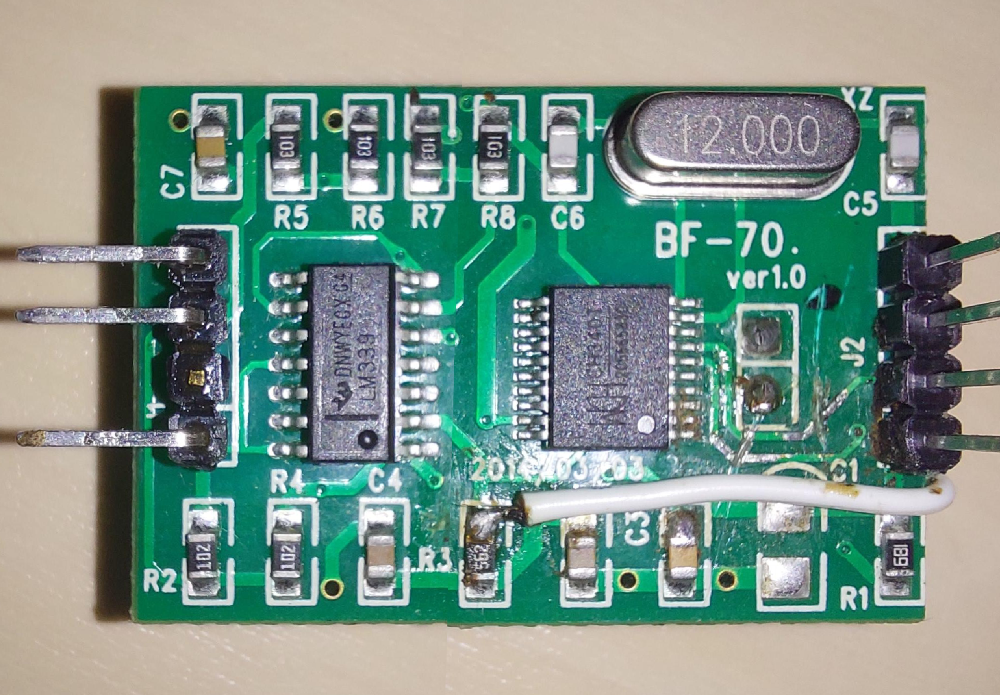
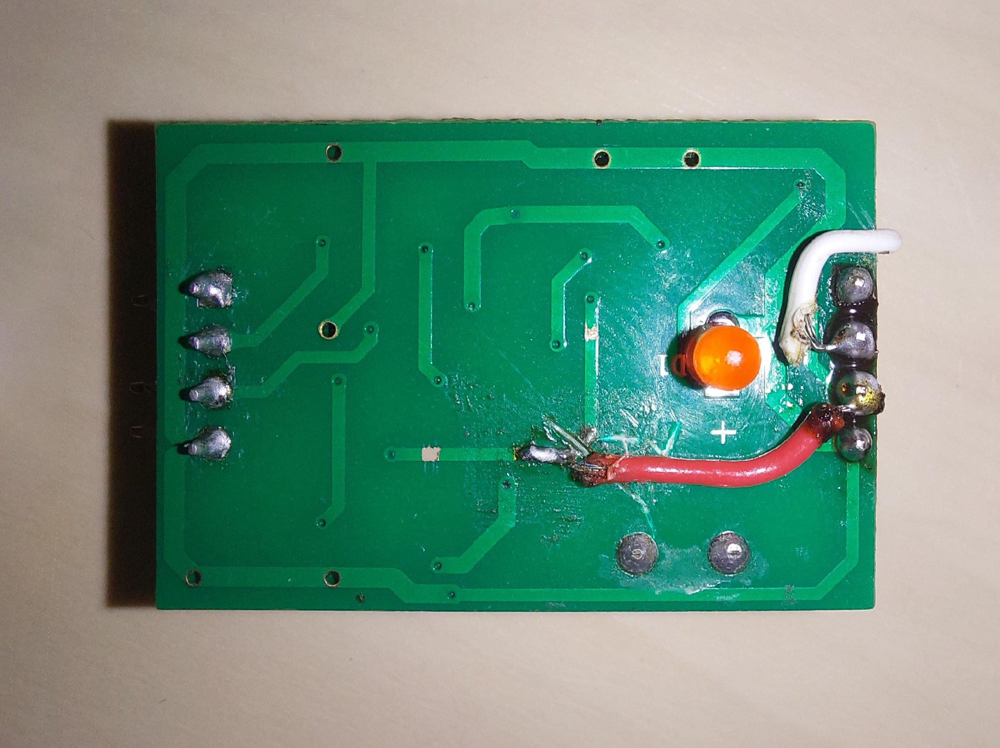
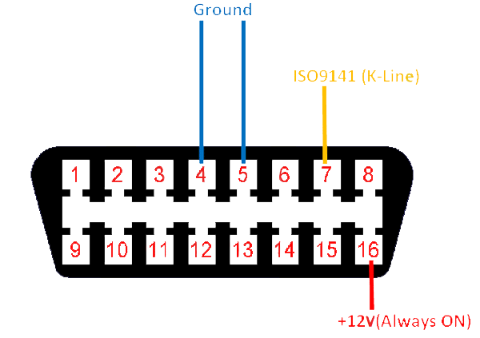

## KW1281_dv

**KW1281_dv** is an Arduino library used for communicating with VAG control modules which use the proprietary VAG KW1281 / KWP1281 protocol.

---

#### Supported features:
- Connecting to any control module that supports KWP1281
- Reading the module's part number + extra fields
- Reading coding and WSC code
- Reading the module's identification field (for example, the vehicle's VIN)
- "Login"
- "Coding" for changing the coding and/or WSC
- "Fault Codes" for reading stored fault codes
- Clearing stored fault codes
- "Adaptation" for reading an adaptation value on a specified channel
- Testing an adaptation value on a specified channel
- Saving an adaptation value to a specified channel
- Ability to keep the connection alive while doing other tasks
- "Meas. Blocks" reading for an entire Meas. Block (calculating actual value + providing proper units of measurement)
- Reading a single value inside a Meas. Block (calculating actual value + providing proper units of measurement)
#### Currently unsupported features:
- reading or writing ROM / EEPROM (firmware)
- "Output Tests"
- "Security Access"
- "Basic Settings"
- labels

## Hardware setup
+ The easiest way to obtain an adapter is to modify a VAG-KKL cable, the cheaper the better.
+ The cheapest cables often contain a Serial-to-USB chip (commonly WCH‑CH340G or FTDI‑FT232RL), which we don't need and a 12V-5V level shifter, usually an LM339 comparator, which we are interested in.
+ In essence, the K-Line diagnostic protocol is just a serial interface with 12V logic.
---
#### Modifying a cable
For simple cables, [**Alexander Grau**'s method](http://grauonline.de/wordpress/wp-content/uploads/obd_adapter_arduino.jpg) is the most straightforward.
- The idea is to cut the connection between the level shifter and the USB chip on the TX (transmit line) so it doesn't interfere with our communications.
- The TX (receive line) can be left alone because it has no negative effects on communication.
- The both 5V and 12V power to the cable are necessary, read below about power options... and don't forget the ground!
####
It's also possible with more complicated cables, as [**mkirbst** shows on GitHub](https://github.com/mkirbst/lupo-gti-tripcomputer-kw1281).
- The core idea is the same, but the author chose to cut both data lines.
- In such a cable where RX / TX lines control (or are controlled with) transistors, the wires for the Arduino need to be connected to the same trace that used to lead directly into the USB chip before cutting them.
####
---
My solution
- As I had one of the cheaper interfaces, I chose **Alexander**'s method, but I also wanted to keep the USB cable for aesthetics and ease of connection to the Arduino.
- Like him, I cut the TX trace, but also the D+ and D- going from the USB cable to the Serial-USB converter chip.
- Next, I soldered the TX line (point on the cut trace, on the LM393's side) to where USB D- previously was (white wire from USB cable), and then the RX line (point on the circuit board connected as close as possible to the LM393 level shifter) to where D+ previously was (green wire from USB cable). Of course, it's your own choice whether RX and TX correspond to D- and D+ or vice-versa, but don't forget which way you chose.
- *Warning*, as with every modified USB cable that isn't actual USB anymore... please don't plug it into a computer after modifying!
####

#### After mods:
####

#### Connection diagram:
####

---
#### Installation location
- For my testing I have been using an original VAG Instruments cluster on my workbench, to which I have connected the adapter board directly to the K-Line.
- In reality, this project will most likely be useful in logging values, installing custom displays or DIY scan tools.
- As such, my hardware setup solution above is useful in the scenario of a scan tool. A much neater approach would be including an Arduino Nano / Pro Micro + step-down voltage regulator inside the housing of the OBD2 connector, or even an Arduino Pro Mini for use cases where the USB connection to a computer is not necessary (logging to SD cards, custom displays etc).
- ***One useful detail to consider is that all modules that communicate with this protocol are all connected to the same K-Line. Wherever you choose to connect it either to the external diganostic port or by tapping into the K-Line on the instruments cluster or the radio, you will be able to connect to any module inside the vehicle.***
+ For the time being, these are installation methods I have thought of:
+ 1. non-intrusive: cable going from OBD2 connector to an external Arduino connected in turn to a computer (for debugging, logging, scanning, coding)
+ 2. non-intrusive: OBD2 connector with a small-form-factor Arduino inside, eventually with an USB cable to a computer
+ 3. slightly intrusive: cable tapped into the K-Line of the cluster or the radio and then going somewhere like the glovebox to an Arduino  (connected to a computer or not) - much neater, and with an added advantage: both of those modules have an S-Kontakt connection available, through which you can check if the vehicle's ignition is on (voltage divider of 2.2K and 1k ohm); there is no such connection on the standard OBD2 diagnostic port.
---
#### Powering options
- If your project requires a computer attached to the Arduino, then you don't need a power source for it. All that is needed is the 12V connection to the cable, which is readily available (on the OBD2 connector or wherever else next to a control module).
####

- If your project is independent from USB cables, the Arduino and cable will need 5V power. The neatest solution is using a step-down converter module, but a hackier approach could be repurposing a car phone charger, let your creativity flow.
- Also, if your project is mostly computer-independent but you plan on connecting it to a computer occasionally (for debugging, for example), consider adding a switch in series to the 5V output of your regulator of choice, as powering an Arduino both from the USB cable and another source at the same time could have bad results.
- A worry for computer-independent projects connected permanently to 12V is of course parasitic power draw. If your project is installed permanently, consider "stealing" the 12V from an S-Kontakt wire instead of permanent 12V.

## The Arduino side of things
This code has been tested well on the Arduino UNO (and it will work the same on its smaller counterparts, the Nano, Pro Micro and Pro Mini). Itshould work fine on the MEGA as well, but I haven't tested it yet.
#####
Bundled is a copy of the *SoftwareSerial* library, so no additional libraries are necesarry for the core operation.
#####
Also included is a full library demo, `KW1281_dv_Demo.ino`.
### Using the library
Please refer to the included demo for in-depth usage tutorials.
- `KW1281_dv KWP(RX, TX)` - create the object, specifying to which pins RX and TX are connected, can be any digital pins except for 0 and 1.
- `connect(address, baudrate, id, coding, wsc)` - attempt connecting to an address (0x01-0xFF) at a baudrate (4800/9600/10400), will store the control module's model number into "id" (character array), the current coding into "coding" and the workshop code into "wsc".
- `VIN(id)` - will store the control module's identification field (which often contains serial numbers or the vehicle's VIN) into "id" (character array).
- `Login(login_code, wsc)` - attempt to login with a code, the workshop code can be random, but if you want to recode it, you will have to provide the desired wsc and then recode
- `Coding(code, wsc)` - recode the module. This will also store the coding it reads after the operation is completed (into the same variable that provided the code).
- `readFaults(dtc, startFrom, amount)` - will read the module's fault codes and store them into "dtc" (16-bit variable array), starting from the "startFrom"-th DTC and storing the "amount" number of them. Considerations:
- 1. "amount" must be less than or equal to the size of the "dtc" array.
- 2. the function will give the number of DTCs available on the module as a return-value, indifferent to the parameters given to the function.
- `clearFaults()` - erases all fault codes from the module. You should run readFaults() afterwards to check if all were cleared.
- `readAdaptation(channel)` - read the value on an adaptation channel (0x00-0xFF). The value stored will be given as a return-value.
- `testAdaptation(channel, value)` - test if a value would be accepted by an adaptation channel. If it wouldn't be accepted, the function will give an acceptable value as a return-value.
- `Adaptation(channel, value, wsc)` - store a value at an adaptation channel, also provide a 5-digit workshop code (doesn't matter, just has to be there). The function will give the value it reads from the channel after adaptation as a return-value.
- `MeasBlocks(group, value1, value2, value3, value4)` - store the 4 values read from a group (0x00-0xFF) into 4 float-variables (value1, value2, value3, value4).
- `SingleReading(group, index, value)` - store the "index"-th reading from a group into the "value" float-variable.
- `MeasBlocksWithUnits(group, value1, value2, value3, value4, type1, a1, b1, type2, a2, b2, type3, a3, b3, type4, a4, b4)` - in addition to MeasBlocks(), it also stores the 12 (3 for each value) variables required for determining the units of measurement for the value.
- `SingleReadingWithUnits(group, index, type, a, b, value)` - in addition to SingleReading(), it also stores the 3 variables required for determining the units of measurement for the value.
- `getUnits(type, a, b, units)` - it's given those 3 variables returned by the functions above and it stores the units of measurement in the "units" character array.
- `keepAlive()` - don't let the connection stop while not fetching data, if not used the communication would die after ~250ms of inactivity
- `define_reset_function(function)` - define which function to execute if the communication resets (explained in the demo).
- `define_wait_5baud_function(function)` - define which function to execute while the communication is initialising (explained in the demo).
- `currAddr` - stores the address that it's currently connected to
####
All functions return different exit codes in case of errors. They are all defined in the `KW1281_dv.h` file and are showcased in the demo.